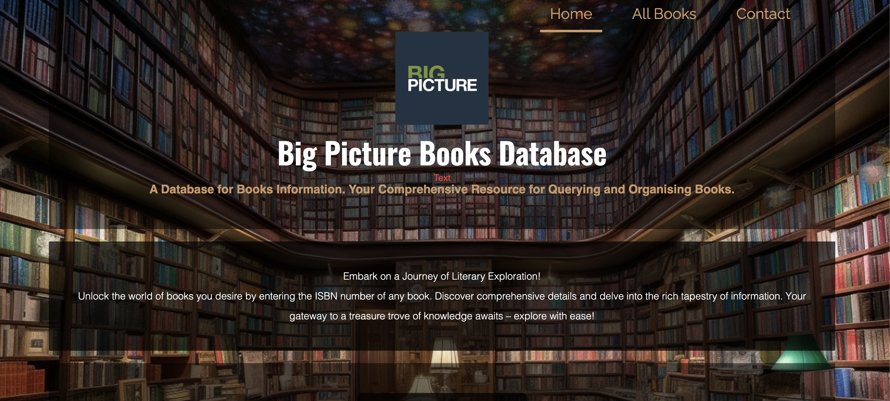
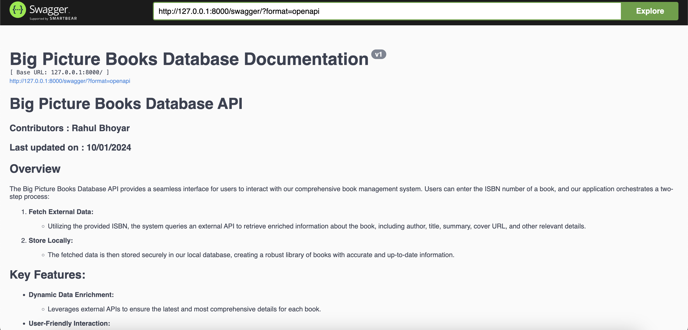

# Big Picture Books Database

**Author : Rahul Rajkumar Bhoyar**

**Date : 10/01/2023**







The Big Picture Books Database is a Django web application that manages information about books, including details such as titles, authors, ISBNs, and more. The application consists of a front-end component for user interaction and a REST API for accessing book data programmatically.

## Table of Contents

- [Requirements Specification](#tech-stack)
- [Tech Stack](#purpose)
- [How Errors ared Handled](#error-handling)

  - [Front End](#front-end)
  - [Back End](#back-end)
    - [Example Error Levels](#example-error-levels)
  - [Swagger Documentation](#swagger-documentation)
- [Getting Started](#getting-started)

  - [Prerequisites](#prerequisites)
  - [Installation](#installation)
- [Running the Application](#running-the-application)

  - [Django Front-end App](#django-front-end-app)
  - [REST API App with Swagger](#rest-api-app-with-swagger)
- [Testing](#testing)
- Note

## Requirements Specification

The objective is to develop a back-end application capable of retrieving book information from third-party APIs and storing it in our local database. The Big Picture Books Database serves as a comprehensive platform for managing and accessing book-related data. It encompasses a user-friendly front-end, facilitating interactive use, and a REST API, enabling programmatic access to book data from the back-end. This versatility makes it suitable for various use cases, ranging from personal book tracking to seamless integration with other systems.

## Tech Stack

- **Django**:   Web framework for building the back-end.
- **Django REST Framework**:  Toolkit for building Web APIs.
- **DRF-YASG**:  Yet Another Swagger Generator for generating Swagger/OpenAPI documentation.
- **Swagger UI**:  Interactive API documentation.
- **HTML, CSS, JavaScript**:  Used for the front-end user interface.
- **SQLite**:   Default database used for development.

## How Errors are Handled

### Front End

The front-end application is designed with user experience in mind, and error handling is implemented to ensure that users receive clear and informative feedback. Common error scenarios, such as invalid input or failed API requests, are gracefully handled with user-friendly messages.

### Back End

The back-end API employs robust error handling to ensure reliable communication with clients. Different levels of errors are distinguished and communicated through the API responses. The [HTTP status codes](https://developer.mozilla.org/en-US/docs/Web/HTTP/Status) are used to indicate the success or failure of an API request. Additionally, detailed error messages are provided in the response to aid developers in identifying and resolving issues.

#### Example Error Levels:

1.**Client-Side Validation Errors (400 Bad Request):**

- Invalid input parameters.
- Missing required fields.
- Validation errors on the client side.

2.**Server-Side Validation Errors (422 Unprocessable Entity):**

- Validation errors detected on the server side.

3.**Server Errors (5xx Server Error):**

- Unhandled server-side exceptions.
- Issues that need attention from the development team.

### Swagger Documentation

The Swagger documentation for the API provides detailed information about each endpoint, including expected request parameters, response formats, and possible error scenarios. Developers can refer to the Swagger UI for interactive exploration and testing of the API.

### Prerequisites

- Python 3.x
- Other dependencies (install using `pip install -r requirements.txt`

### Installation

1. Clone the repository

   ```bash
   git clone https://github.com/rahulbhoyar1995/big-picture-code-challenge.git
   ```
2. Navigating to Directory

```bash
    cd big-picture-code-challenge/big_picture_book_library
```

3. Install dependencies

   ```bash
   pip install -r requirements.txt
   ```
4. Create migration files based on models

   ```bash
   python manage.py makemigrations
   ```
5. Apply migrations to set up the database

   ```bash
   python manage.py migrate
   ```

## Running the Application

### Django Front-end App (Front-end/clide side application)

1. Start the Django development server:

```bash
python manage.py runserver
```

2. Access the front-end app in your web browser :      [http://127.0.0.1:8000/]()

### REST API App with Swagger (Back-end/server-side application)

1. Start the Django development server for the API:

```bash
python manage.py runserver
```

2. Access the Swagger documentation in your web browser :      [http://127.0.0.1:8000/swagger/]()

## Testing

Run the tests using the following command:

```bash
python manage.py test
```

## Note

Please let me know if any modification or improvement is needed.

Rahul Bhoyar

rahulbhoyaroffice@gmail.com
